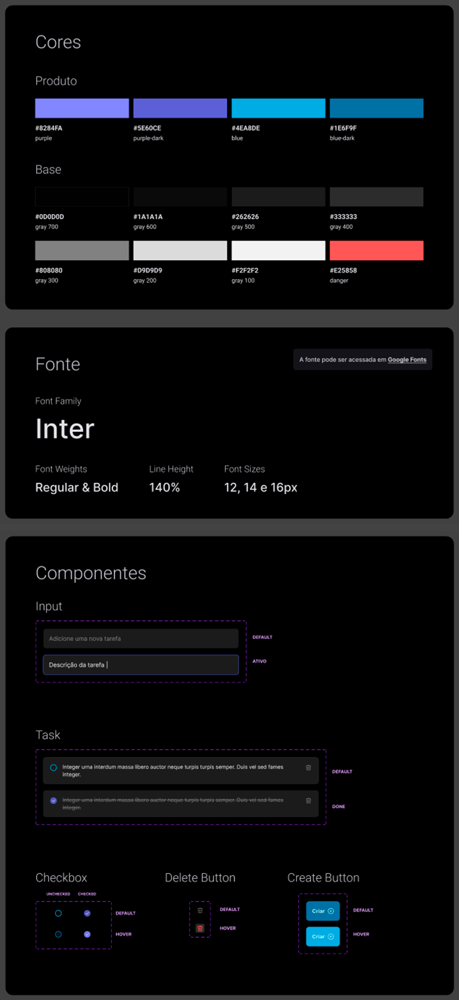

# ToDo List React

**ToDo list** desenvolvido em react + Typescript como desafio do curso de React da Rocketseat.
É um projeto pequeno, porém separei em vários componentes para estudar melhor como funciona a comunicação entre os componentes através das props.

Demo: [ToDo list](https://eduardodv.github.io/todo-list-react/)

 

  
 

## Como instalar

### `npm i`
Instala os pacotes.

### `npm run dev`
Inicia o projeto por padrão no caminho http://localhost:5173

## Design dos componetes

 

  
 

